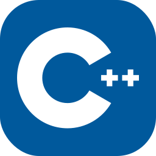
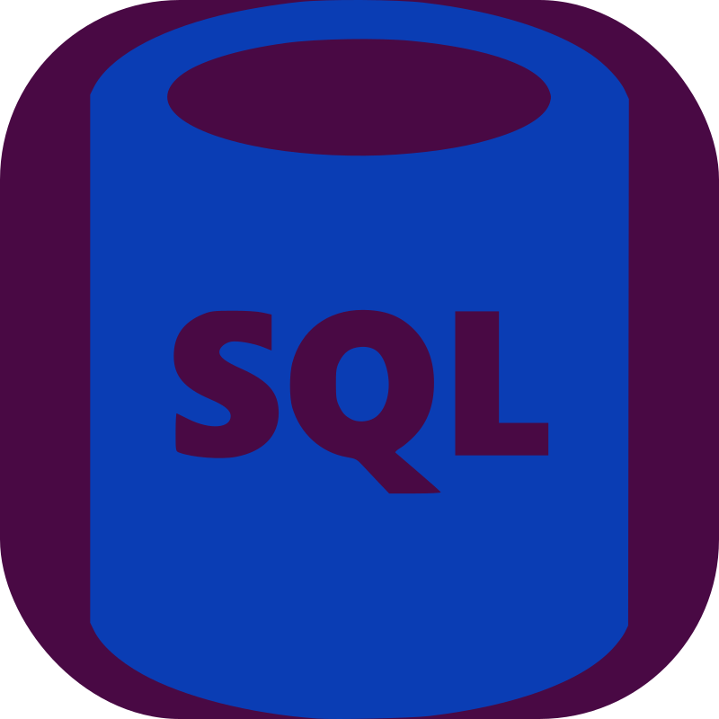

  

# 🔨 My coding portfolio:
## Developing in:
###### Programming languages:
- Java 
  </img>
- Kotlin 
  </img>
- JavaScript / TypeScript 
  </img>
  </img>

###### Frameworks:
- JavaFX 
  </img>
- Gradle 
  </img>

## Growing amateur in:
###### Programming languages:
- Batch 
  </img>
- C / C++ 
  </img>
  </img>
- GLSL Shaders 
  </img>
- Python 
  </img>
- HTML 
  </img>
- CSS 
  </img>

###### Frameworks:
- OpenGL 
  </img>

###### Other:
- JVM reverse engineering 
  </img>

## Had a practice with:
###### Programming languages:
- ANTLR4 
  </img>
- SQL 
  </img>

###### Frameworks:
- Ant 
  </img>
- Bun 
  </img>
- Deno 
  </img>
- React JS 
  </img>
- IntelliJ IDEA Plugins, Grammar-Kit / JFlex 
  </img>

## 🤴 Socials:
- Discord: `rivta` 
  <!-- </img> -->

## 🗣 Languages:
- Russian
- English (studying)
