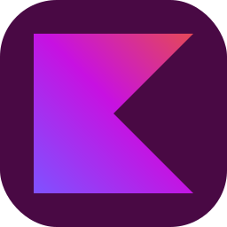

  

# 🔨 My coding portfolio:
## Developing in:
###### Programming languages:
- Java 
  <!---->
- Kotlin 
  <!---->
- JavaScript / TypeScript 
  <!---->
  <!---->

###### Frameworks and other stuff:
- JavaFX 
  <!---->
- Gradle 
  <!---->

## Growing amateur in:
###### Programming languages:
- Batch 
  <!---->
- C / C++ 
  <!---->
  <!---->
- GLSL Shaders 
  <!---->
- Python 
  <!---->
- HTML 
  <!---->
- CSS / SCSS 
  <!---->

###### Frameworks and other stuff:
- OpenGL 
  <!---->
- JVM reverse engineering 
  <!---->
- Next JS 
  <!---->
- React JS 
  <!---->
- Tailwind CSS 
  <!---->

## Had a practice with:
###### Programming languages:
- ANTLR4 
  <!--
- SQL 
  <!---->
- C# 
  <!---->

###### Frameworks and other stuff:
- Ant 
  <!---->
- Deno 
  <!---->
- IntelliJ IDEA Plugins, Grammar-Kit / JFlex 
  <!---->

## 🤴 Socials:
- Discord: `rivta` 
  <!--  -->

## 🗣 Languages:
- Russian
- English (studying)
